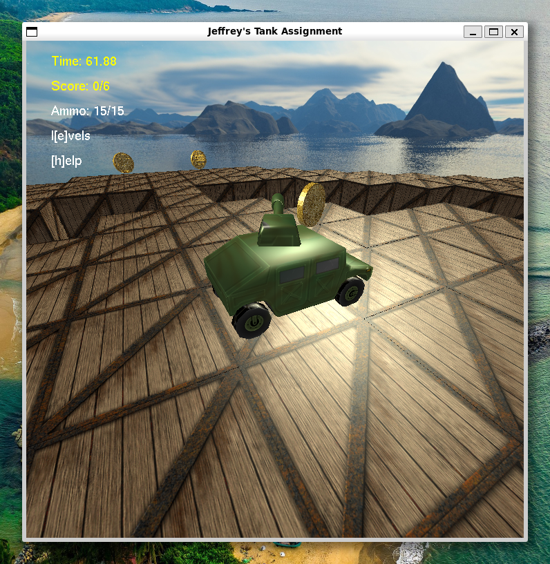
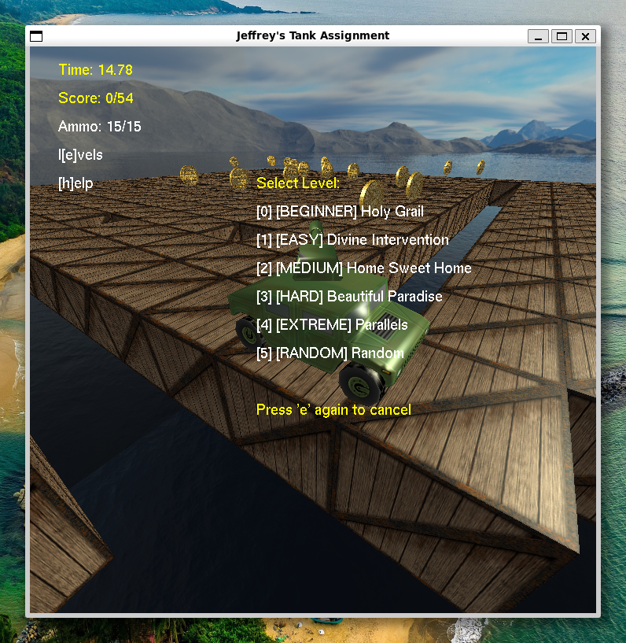
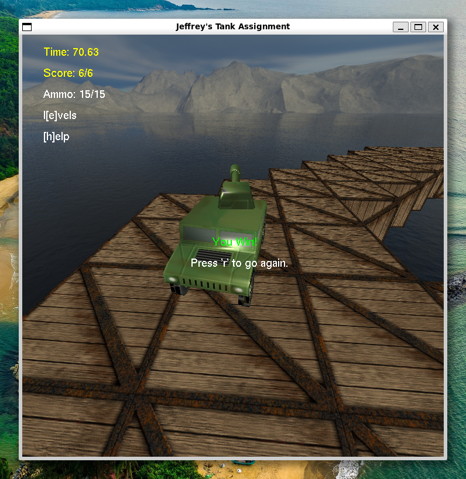
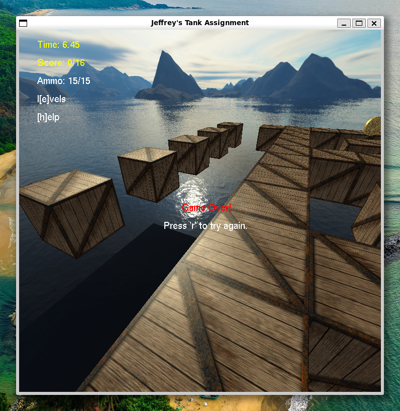

# Tank Game

A tank game made with OpenGL that I made for one of my university modules.

# Showcase

First level of the game.

The level selection menu with a randomly generated map in the background.

Victory.

Defeat.

# TODO

- Add a guide on how to easily compile and run this.